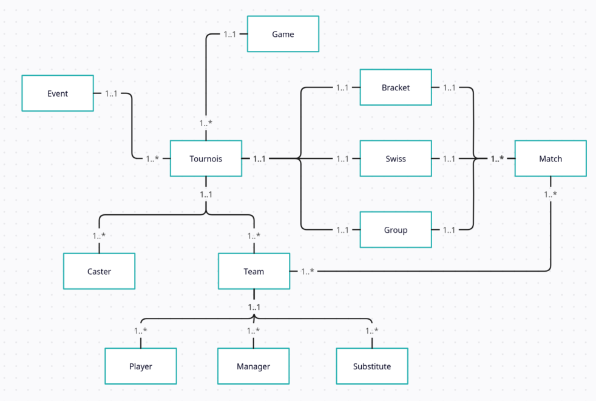

# Tournament

## Introduction

Oh non, pas le module de tournoi ! Et si, on parle bien de ce mastodonte. Le
module de tournoi est celui qui gère les tournois (no joke). Il permet de créer
des tournois, de les gérer, d'inscrire des équipes, de gérer les matchs, les
résultats, etc. Bref, c'est un module qui fait beaucoup de choses mais qui est
centrale pour notre application.

Nous allons détailler un peu l'arborecence du module pour que ce soit plus
clair.

## Arborescence

Bon, c'est un gros morceau mais on va essayer de le détailler un peu. On peut
voir sur ce schéma que le modèle `Tournament` est le coeur du module. C'est lui
qui gère les tournois. Il dépend d'un `Event` qui est l'événement auquel le
tournoi est rattaché (Insalan XVIII par exemple). Il a aussi une relation avec
`Game` qui est le jeu sur lequel le tournoi est basé (League of Legends,
Counter-Strike, etc).

Le modèle `Team` est celui qui gère les équipes. Il est lié à `Tournament` car
une équipe est forcément inscrite à un tournoi. Il contient aussi des
inscriptions sous forme de `Player` qui sont les joueurs de l'équipe, `Manager`
qui est le manager de l'équipe, et `Substitute` qui sont les remplaçants de
l'équipe.

De l'autre côté, on a le modèle `Match` qui gère les matchs. Il est lié à
`Tournament` via un modèle qui décrit le format du tournois (poules, arbre,
round swiss,...). Il est aussi lié à `Team` car un match oppose deux équipes. 

Et,... Bah c'est tout. Finalement pas besoin d'aspirine.